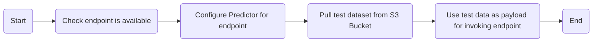

# AWS Lambda Model Evaluation

[](https://www.python.org/downloads/release/python-3121/)
[](https://github.com/kwame-mintah/aws-lambda-model-evaluation/actions/workflows/bump-repository-version.yml)
[](https://github.com/kwame-mintah/aws-lambda-model-evaluation/actions/workflows/push-docker-image-to-aws-ecr.yml)
[](https://github.com/kwame-mintah/aws-lambda-model-evaluation/actions/workflows/run-python-linter.yml)
<a href="https://github.com/psf/black"></a>

A lambda to invoke an AWS SageMaker model endpoint with test data stored within an S3 Bucket. For analyzing a dataset to
[generate baseline constraints](https://sagemaker.readthedocs.io/en/stable/amazon_sagemaker_model_monitoring.html).
Allowing for monitoring machine learning (ML) model quality to determine if new model predictions are accurate or not,
additionally detect changes in properties.

This repository does not create the AWS Simple Queue Service, this is created via Terraform found here [terraform-aws-machine-learning-pipeline](https://github.com/kwame-mintah/terraform-aws-machine-learning-pipeline).
Additionally, data uploaded for ML purposes can be found here [ml-data-copy-to-aws-s3](https://github.com/kwame-mintah/ml-data-copy-to-aws-s3).
For more details on the entire flow and how this lambda is deployed, see [aws-automlops-serverless-deployment](https://github.com/kwame-mintah/aws-automlops-serverless-deployment).

# Flowchart

The [diagram below](https://mermaid.js.org/syntax/flowchart.html#flowcharts-basic-syntax) demonstrates what happens when
the lambda is trigger, when a new message is placed on the SQS.



# Notice

An assumption has been made that a serverless endpoint has been created for inference. And not able to make of
[`DataCaptureConfig`](https://docs.aws.amazon.com/sagemaker/latest/dg/model-monitor-data-capture-endpoint.html), this is
because the configuration is not supported for serverless endpoint(s) and will have to rely on CloudWatch logs as per
official [documentation](https://docs.aws.amazon.com/sagemaker/latest/dg/serverless-endpoints-monitoring.html).

A workaround is to invoke the endpoint and create a confusion matrix with the predicated vs actuals, this is then uploaded
to another bucket as in markdown format.

## Development

### Dependencies

- [Python](https://www.python.org/downloads/release/python-3121/)
- [Docker for Desktop](https://www.docker.com/products/docker-desktop/)
- [Amazon Web Services](https://aws.amazon.com/?nc2=h_lg)

## Usage

1. Build the docker image locally:

   ```shell
   docker build --no-cache -t aws_lambda:local .
   ```

2. Run the docker image built:

   ```shell
   docker run --platform linux/amd64 -p 9000:8080 aws_lambda:local
   ```

3. Send an event to the lambda via curl:
   ```shell
   curl "http://localhost:9000/2015-03-31/functions/function/invocations" -d '{<EXPAND_BELOW_AND_REPLACE_WITH_JSON_BELOW>}'
   ```
   <details>
   <summary>Example AWS SQS event received</summary>
   ```json
    {
      "Records": [
        {
          "messageId": "059f36b4-87a3-44ab-83d2-661975830a7d",
          "receiptHandle": "AQEBwJnKyrHigUMZj6rYigCgxlaS3SLy0a...",
          "body": "{\"endpointName\": \"example\", \"testDataS3BucketName\": \"example-bucket\", \"testDataS3Key\" : \"test-data.csv\"}",
          "attributes": {
            "ApproximateReceiveCount": "1",
            "SentTimestamp": "1545082649183",
            "SenderId": "AIDAIENQZJOLO23YVJ4VO",
            "ApproximateFirstReceiveTimestamp": "1545082649185"
          },
          "messageAttributes": {},
          "md5OfBody": "098f6bcd4621d373cade4e832627b4f6",
          "eventSource": "aws:sqs",
          "eventSourceARN": "arn:aws:sqs:us-east-1:111122223333:my-queue",
          "awsRegion": "us-east-1"
        }
      ]
    }
   ```
   </details>

## GitHub Action (CI/CD)

The GitHub Action "🚀 Push Docker image to AWS ECR" will check out the repository and push a docker image to the chosen AWS ECR using
[configure-aws-credentials](https://github.com/aws-actions/configure-aws-credentials/tree/v4.0.1/) action. The following repository secrets need to be set:

| Secret             | Description                  |
|--------------------|------------------------------|
| AWS_REGION         | The AWS Region.              |
| AWS_ACCOUNT_ID     | The AWS account ID.          |
| AWS_ECR_REPOSITORY | The AWS ECR repository name. |
